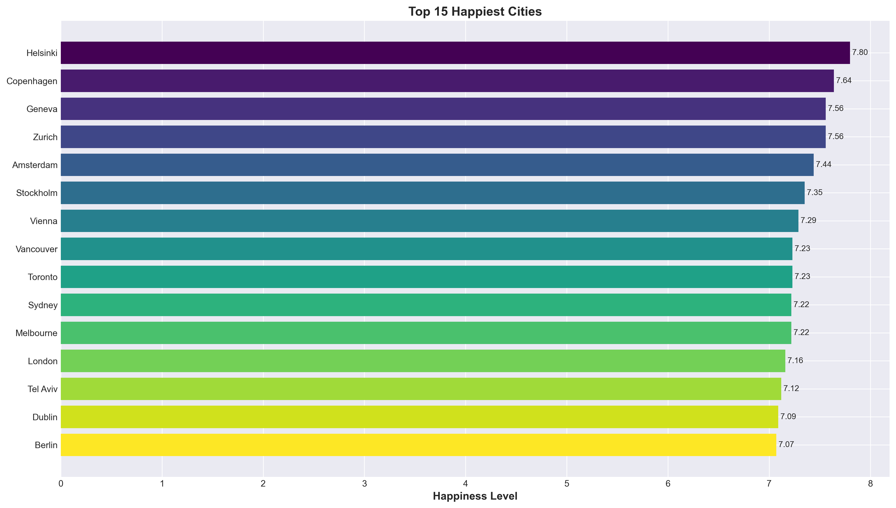
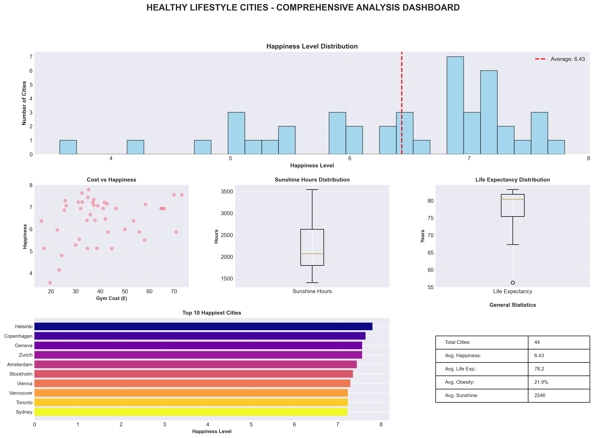

# 🏙️ Healthy Lifestyle Cities Analysis - 2021

A comprehensive data analysis project examining healthy lifestyle factors across 44 major cities worldwide.

## 📊 Project Overview

This project analyzes the **Healthy Lifestyle Cities Report 2021** dataset to uncover insights about factors contributing to healthy urban living. The analysis includes data cleaning, statistical analysis, and 10 professional visualizations.

## 🎯 Key Features

- **Data Cleaning & Preprocessing**: Handled missing values, converted data types, and normalized numeric columns
- **Statistical Analysis**: Correlation analysis, PCA (Principal Component Analysis)
- **10 Professional Visualizations**:
  1. Top 15 Happiest Cities
  2. Sunshine Hours vs Happiness Level
  3. Gym Membership Cost Comparison
  4. Feature Correlation Matrix (Heatmap)
  5. Outdoor Activities vs Obesity Rate
  6. Air Quality Distribution
  7. Life Expectancy Analysis (Top & Bottom Cities)
  8. PCA Analysis - Multidimensional City Clustering
  9. Top 5 Cities Radar Chart Comparison
  10. Comprehensive Dashboard Overview

## 📈 Dataset

**Source**: [Kaggle - Healthy Lifestyle Cities Report 2021](https://www.kaggle.com/datasets/prasertk/healthy-lifestyle-cities-report-2021)

**Features**:
- City & Rank
- Sunshine hours
- Cost of water & gym membership
- Obesity levels
- Life expectancy
- Pollution index
- Annual average hours worked
- Happiness levels
- Outdoor activities
- Number of takeout places

**Total Cities**: 44  
**Total Features**: 12

## 🛠️ Technologies Used

- **Python 3.14**
- **Pandas** - Data manipulation and analysis
- **NumPy** - Numerical computing
- **Matplotlib** - Data visualization
- **Seaborn** - Statistical data visualization
- **Scikit-learn** - Machine learning (PCA, StandardScaler)

## 📁 Project Structure

```
Health_Lifestyle_Cities_Report/
│
├── healthy_lifestyle_cities_report_project.py  # Main analysis script
├── healthy_lifestyle_cities_report.csv         # Dataset
│
├── Generated Visualizations/
│   ├── 1_top_cities_happiness.png
│   ├── 2_sunshine_vs_happiness.png
│   ├── 3_gym_cost_comparison.png
│   ├── 4_correlation_heatmap.png
│   ├── 5_activities_vs_obesity.png
│   ├── 6_air_quality_distribution.png
│   ├── 7_life_expectancy_analysis.png
│   ├── 8_pca_analysis.png
│   ├── 9_radar_top5_cities.png
│   └── 10_comprehensive_dashboard.png
│
└── README.md
```

## 🚀 Installation & Usage

### Prerequisites

```bash
pip install pandas numpy matplotlib seaborn scikit-learn
```

### Running the Analysis

1. Clone this repository:
```bash
git clone https://github.com/KaanOzgurr/healthy-lifestyle-cities-analysis.git
cd healthy-lifestyle-cities-analysis
```

2. Ensure the dataset CSV file is in the same directory

3. Run the analysis:
```bash
python healthy_lifestyle_cities_report_project.py
```

4. View generated PNG charts in the project folder

## 📊 Key Insights

### 🏆 Top Findings:
- **Happiest Cities**: Amsterdam, Sydney, Vienna lead the rankings
- **Life Expectancy**: Strong correlation with happiness levels and outdoor activities
- **Pollution Impact**: Cities with better air quality show higher happiness scores
- **Cost vs Happiness**: Gym membership costs don't directly correlate with happiness
- **Sunshine Paradox**: More sunshine hours show moderate positive correlation with happiness

### 📉 Correlation Highlights:
- Outdoor activities negatively correlate with obesity rates (-0.4)
- Life expectancy positively correlates with happiness (+0.6)
- Pollution index negatively impacts overall city rankings

## 📸 Sample Visualizations

### Top 15 Happiest Cities


### Comprehensive Dashboard


*Note: All 10 visualizations are generated automatically when running the script*

## 🔍 Data Cleaning Process

The script performs the following data cleaning steps:
1. Remove currency symbols (£) from cost columns
2. Remove percentage signs (%) from obesity data
3. Handle missing values represented by '-'
4. Convert object types to numeric (float) using `pd.to_numeric()` with error handling
5. Standardize data for PCA analysis using `StandardScaler`

## 📝 Future Improvements

- [ ] Add interactive visualizations using Plotly
- [ ] Implement machine learning models for city ranking prediction
- [ ] Add time-series analysis if multi-year data becomes available
- [ ] Create a web dashboard using Streamlit or Dash
- [ ] Add more statistical tests (t-tests, ANOVA)

## 👤 Author

**Your Name**
- GitHub: [@KaanOzgurr](https://github.com/KaanOzgurr)
- LinkedIn: [Your Profile](https://linkedin.com/in/yourprofile)

## 📄 License

This project is licensed under the MIT License - see the LICENSE file for details.

## 🙏 Acknowledgments

- Dataset provided by Prasert K on Kaggle
- Original data compiled from various health and lifestyle indices
- Inspired by global health and urban planning research

## 📞 Contact

For questions or feedback, please open an issue or reach out via email.

---


## Dataset
This project uses a dataset from Kaggle.

The dataset is licensed under its own license and is not covered by the MIT License.
Please refer to the Kaggle dataset page for license details.


⭐ **Star this repository if you found it helpful!**
